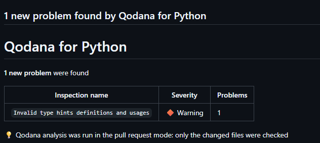

# JetBrains Qodana SAST PoC with GitHub Actions

This proof of concept validates JetBrains Qodana as a SAST tool in a small Flask backend pipeline.

## Pipeline flow

```text
Push or pull request
        |
        v
GitHub-hosted runner (ubuntu-latest)
        |
        +-- Run pytest and create coverage.xml
        |
        +-- Run JetBrains Qodana Scan (JetBrains/qodana-action@v2026.2.0)
        |
        v
Upload SARIF report to GitHub Security / Code Scanning tab
```

## What the PoC measures

- Whether push and pull-request scans complete successfully.
- Whether Qodana finds actionable Flask, Django, and Python security issues.
- False positives found while reviewing the results.
- Test, scan, and total workflow duration.

The files under `sast-fixtures/` intentionally contain insecure examples to confirm that the scanner detects known security problems.

## Repository contents

```text
.github/workflows/backend-sast.yml  GitHub Actions workflow running Qodana SAST
app/                                Sample Flask backend
tests/                              Pytest tests
sast-fixtures/                      Deliberately insecure scan fixtures
qodana.yaml                         Qodana configuration file
```

## 1. Run the application and tests locally

Create a virtual environment and install the dependencies:

```bash
python -m venv .venv
source .venv/bin/activate
python -m pip install -r requirements.txt
```

Run the tests and generate coverage report:

```bash
python -m pytest --cov=app --cov-report=term-missing --cov-report=xml:coverage.xml
```

Run the sample API:

```bash
python run.py
```

The API is available at `http://127.0.0.1:5000`.

## 2. Configure Qodana & Token Requirements

Qodana is configured via `qodana.yaml` in the root of the repository:

- Linter: `jetbrains/qodana-python-community:latest`
- Profile: `qodana.recommended` (includes `CheckSecurity` inspection profile)

### Token Requirements:
- **No Token Required (Default / Standalone Mode)**: You do **NOT** need to configure `QODANA_TOKEN` for standard CI/CD analysis. Qodana runs standalone on the GitHub Runner and uploads findings as a SARIF report directly to the GitHub **Security > Code scanning** tab.
- **Optional Qodana Cloud Integration**: If you wish to sync results with [Qodana Cloud](https://qodana.cloud/), add your project token as a GitHub secret named `QODANA_TOKEN` (**Settings > Secrets and variables > Actions > Secrets**).

## 3. Run and verify

The workflow runs on:

- Pushes to `main`.
- Pull requests targeting `main`.
- Manual runs from **Actions > Backend CI and Qodana SAST > Run workflow**.

Verify the following after a run:

1. `Backend tests` passes and uploads `coverage.xml`.
2. `Qodana SAST Scan` executes and generates results.
3. The SARIF results are uploaded to the GitHub Repository **Security > Code scanning** tab.

## 4. Scan Results & Remediation



### Observed Findings:
- **Inspection Name**: `Invalid type hints definitions and usages`
- **Severity**: `Warning`
- **Root Cause**: Python 3.10 union type syntax (`dict | None`) and unimported generic hints were used in type annotations without `from __future__ import annotations`.

### Remediation Applied:
- Added `from __future__ import annotations` to `app/__init__.py`, `app/routes.py`, and `app/services.py`.
- Updated type annotations to use standard `typing` types (`Optional[Dict[str, Any]]`, `Tuple[Dict[str, str], int]`, `Dict[str, str]`).

## References

- [JetBrains Qodana Documentation](https://www.jetbrains.com/help/qodana/welcome.html)
- [Qodana GitHub Action](https://github.com/JetBrains/qodana-action)
